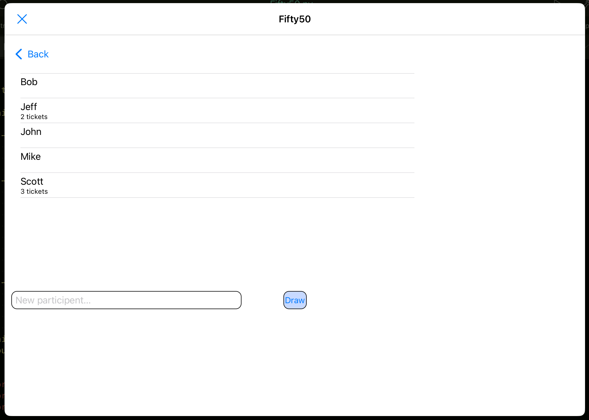
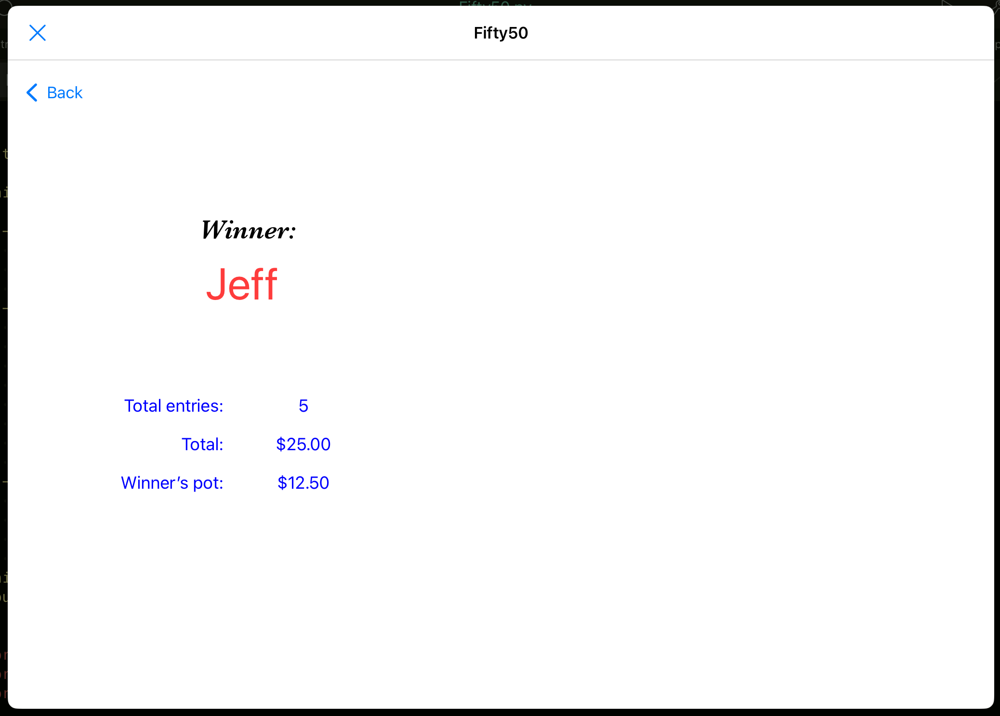

# Fifty50
A ticketless 50/50 raffle drawing

written for iOS / iPadOS Pythonista app

In a traditional 50/50 raffle
drawing, tickets are sold at
a fixed price to a limited group
of people (within a club, team,
family reunion,...), and at
a specific time, sales are 
closed and kne ticket is drawn
and the winner receives half of
the proceeds. The other half
goes to the club or charity. 

Then, all the tickets are thrown
away, as they're no longer of
use. This seemed wasteful to
me. 

This program creates "virtual
tickets", and handles the
"drawing" using the random
number generator. No waste. 

This program runs in the iOS / iPadOS Pythonista environment.
It is composed of three major screens or windows: The Setup view,
the Entries view, and the Winner view. 

The first screen seen
is the Setup view. It contains two fields: The first is the
cost per ticket. This is used to calculate the total and the
pot to be received by the winner. The second field is a name 
for a JSON file to hold the names of the people buying tickets.
If the file does not exist, it will be created as an empty list.
The names are kept across uses, so that a semi-constent group
of names will not need to be entered each time.

After hitting Continue, the second screen is shown. THis is 
a list of names, with a count of the number of tickets
purchased by each person. Clicking on a person's name will
add one to the number of tickets. A field for entering new
names is at the bottom of the of the view. If a name needs to be
removed or edited, swipe left on the name to delete it, then 
re-enter the name correctly.

Once sales of tickets is complete, touch Draw to open the 
Winner screen. At this point, the compiled list will be
used along with the random number generator to pick a winner
from the list of names, weighted by the number of tickets
each person purchased. The name of the winner, the total
number of tickets sold and the total dollar amount, and 
the winner's prize are shown in the view.
